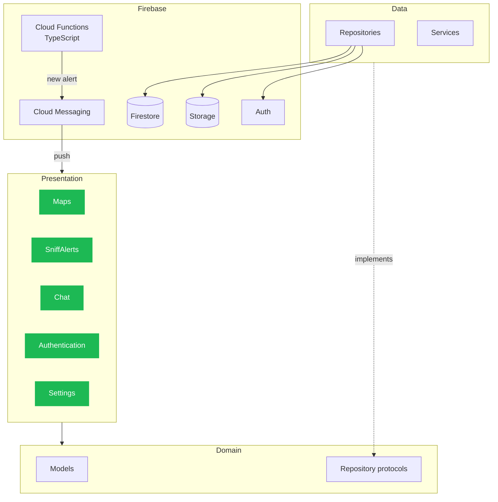

<div align="center">


[](https://apps.apple.com/us/app/sniff-radar/id6759757441)

</div>

> 🔒 **The source code is private.** This repo explains what the app does, how it is built and the main decisions I made. I'm happy to walk through the real code in an interview.

## The problem

When a pet goes missing, the first hours matter most. But most people have no fast way to tell their neighbors. Posts on social media get lost, and the people who could help never see them.

## What the app does

Sniff Radar lets you send a geolocated alert the moment your pet goes missing. People nearby get a push notification, see the place on a map and can talk to you right away.

- 📍 **Alerts on a map.** Active cases show up on a map with MapKit, based on where you are.
- 🔔 **Push to people nearby.** When a case is created, a Cloud Function finds users in the area and sends a push with Firebase Cloud Messaging.
- 💬 **Real time chat.** Owners and finders talk inside the app, with message states and case status.
- 🛡️ **Anti spam by design.** Anyone who says they found a pet must send a photo before a chat opens. Users can also block and report other users.
- ✅ **Case resolution.** The owner closes the case when the pet is back home, and the alert leaves the map.
- 🔐 **Sign in with Apple and Google.**
- 🌎 **More than one language** with String Catalogs.

## Architecture

The app uses **MVVM with Clean Architecture**, split by feature. Views only show state. ViewModels hold the logic. Repositories hide Firebase, so the domain layer does not know where the data comes from.



```
Pawmunity/
├── App/              # App entry and setup
├── Core/             # Theme, Localization, Networking, Security, Debug
├── Domain/           # Models and repository protocols
├── Data/             # Repositories and services (Firebase)
├── Features/         # Authentication, Maps, SniffAlerts, Chat, Home, Settings
├── Infrastructure/
└── Resources/
functions/src/        # Cloud Functions in TypeScript (alerts)
firestore.rules       # Security rules
```

## Decisions I'm proud of

**Security rules first.** Chats and cases are protected by Firestore security rules, not only by the app. A user can only read chats they are part of, even if someone calls the API directly.

**Push logic on the server.** Finding who is nearby and sending the push happens in a Cloud Function. The app stays light, and the rule can change without a new App Store release.

**Photo before chat.** A simple product rule that stops most fake "I found your dog" messages before they start.

**Feature folders.** Each feature has its own views and ViewModels, so the code base stays easy to move around as it grows.

## Tech stack

| Area | Tools |
|---|---|
| UI | SwiftUI, MapKit |
| Architecture | MVVM, Clean Architecture, repository pattern |
| Location | CoreLocation |
| Backend | Firebase Auth, Cloud Firestore, Firebase Storage |
| Server logic | Cloud Functions (TypeScript) |
| Push | Firebase Cloud Messaging, UserNotifications |
| Login | Sign in with Apple, Google Sign-In |
| Languages | String Catalogs (`Localizable.xcstrings`) |

## Screenshots

_Coming soon._

---

<div align="center">

Built by [Charles Yamamoto](https://github.com/Lophiester) · [LinkedIn](https://www.linkedin.com/in/charles-yamamoto-26699b203/) · [yamaflare.com](https://yamaflare.com)

</div>
